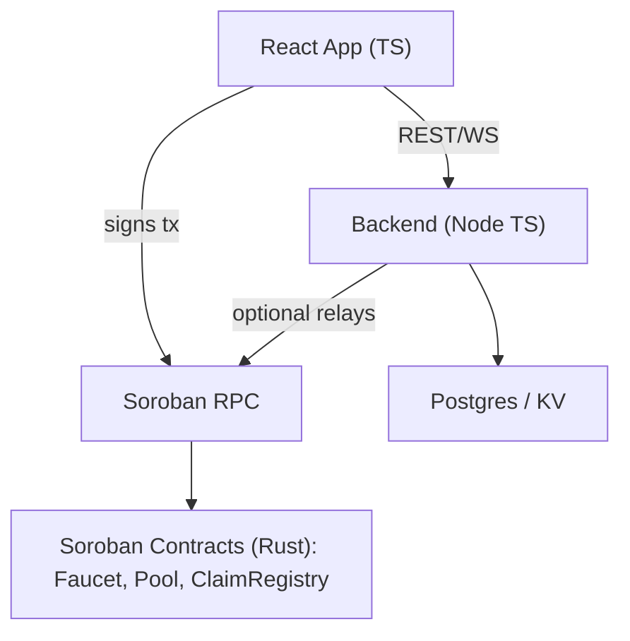

## build structure

### technology choices
- **frontend**: TypeScript + React (already in repo)
  - **reason**: fast iteration, great dx, rich ecosystem for wallets/qr/ui
- **smart contracts**: Rust + Soroban (already in repo)
  - **reason**: you already have faucet + pool logic; keep contract logic on-chain in rust with soroban sdk
- **backend (optional but recommended)**: TypeScript (Node) with a small service layer (e.g., NestJS or Fastify)
  - **reason**: complements frontend, easy auth/webhooks/relayer tasks, familiar dx, great libs
- **storage**
  - **on-chain**: balances, shares, claims state
  - **off-chain**: user profiles, tickets, redemptions, analytics; use Postgres (via Prisma) or serverless KV (e.g., Cloudflare D1) depending on scale
- **infra**: Vite for frontend, GitHub Actions for CI, Docker for backend, soroban-cli for contracts

### architecture overview
- **client (react + ts)**: reads from soroban via rpc; signs tx with wallet; calls backend for off-chain tasks
- **backend (node + ts)**: optional relayer, qr redemption api, rate limiting, analytics, webhook ingestion
- **contracts (rust + soroban)**: liquidity pool, faucet, claim registry



### domain model (entities)
- **user**: account profile + beny points
- **ticket**: claimable right to attend/redeem
- **token**: on-chain assets ($SLICE, $DRINK)
- **liquiditypool**: pool state, reserves, shares
- **faucet**: distribution config and state
- **claim**: per-user claim windows and history
- **redemption**: off-chain proof a physical item was redeemed (qr scan)
- **event**: party metadata; venue, time, promos

### frontend design
- **state**
  - authState: user session (email/account id)
  - tokensState: balances, prices, claims availability
  - tasksState: 3-step gamification
  - uiState: modals, toasts, loading
- **services (pure ts modules)**
  - walletService: connect/select wallet, sign+submit
  - contractService: typed clients for faucet/pool (rpc reads + tx builders)
  - redemptionService: talk to backend for qr and proof
  - analyticsService: events (page, claim, redeem)
- **routes/screens**
  - LoginScreen
  - ExchangeScreen
  - ConfirmationScreen
  - AdminScreen (later: manage faucet parameters)
- **components**
  - TokenRow, Task, QRScannerModal, Spinner, AdCard, Toasts
- **error handling**
  - unified Result<T, E> style in services; surface user-friendly messages
- **i18n**
  - simple dictionary loader (es/en)

### smart contracts (rust + soroban)
- **faucet**
  - state: admin, pool address, faucet_amount, claim_interval, token_selector
  - read: get_faucet_amount, get_claim_interval, get_token_type, get_share_balance, get_available_for_claims, can_claim, time_until_next_claim
  - write (admin): set_faucet_amount, set_claim_interval, set_token_type, deposit_liquidity
  - write (user): claim(to)
- **liquidity_pool**
  - state: reserves, total_shares, token addresses
  - read: get_rsrvs, get_tokens
  - write: deposit, withdraw, swap (as needed)
- **claim_registry (new, small)**
  - state: map Address -> last_claim_timestamp
  - read: can_claim, next_claim_at
  - write: record_claim
  - note: can be merged with faucet if desired; separate keeps single-responsibility

### backend (optional) design
- **responsibilities**
  - qr redemption api: issue short-lived redemption tokens; validate scan; prevent double-spend; log redemptions
  - relayer (optional): submit tx on behalf of mobile users with rate limits
  - webhooks: ingest social proofs (e.g., “tweet posted” to award points)
  - admin apis: configure promos, see analytics
- **modules**
  - auth: magic link + session (email-based), or wallet-based sign-in with siws (sign in with soroban)
  - redemption: startRedemption(tokenType), completeRedemption(code, signature)
  - analytics: event ingestion
  - admin: faucet/pool config mirrors (read-only cache)
- **storage schema (high level)**
  - users(id, email, account_id, display_name, beny_points, created_at)
  - events(id, name, starts_at, ends_at, venue)
  - tickets(id, user_id, event_id, status)
  - redemptions(id, user_id, token_code, status, created_at, completed_at, qr_nonce)
  - claims(id, user_id, faucet_id, claimed_at)
- **security**
  - all redemption endpoints require nonce + signature (wallet or issued token)
  - rate limit per ip/account; anti-replay on qr tokens (single-use)

### program structure (directories)
```text
frontend/
  components/
  screens/
  services/
    walletService.ts
    contractService/
      faucetClient.ts
      poolClient.ts
    redemptionService.ts
    analyticsService.ts
  state/
    store.ts          # zustand or redux
    slices/
  lib/
    rpc.ts            # soroban rpc client
    config.ts         # env
  types/
    domain.ts
    contract.ts

backend/              # if added
  src/
    modules/
      auth/
      redemption/
      admin/
      analytics/
    prisma/           # if postgres
  Dockerfile
  .env.example

contracts/
  faucet/
  liquidity_pool/
  claim_registry/
```

### interfaces and classes (concise)
- **frontend types (ts)**
  - User { id, email, accountId?, name, benyPoints }
  - Token { code, name, balance }
  - ClaimWindow { canClaim: boolean, secondsUntilNext: number }
  - RedemptionRequest { tokenCode, nonce }
  - RedemptionResult { redeemed: boolean, txHash? }
- **contract clients (ts)**
  - FaucetClient
    - read: getFaucetAmount(), getClaimInterval(), getTokenType(), canClaim(address), timeUntilNextClaim(address), getAvailableForClaims()
    - tx build: claim(to), setFaucetAmount(newAmount), setClaimInterval(newInterval), setTokenType(whichToken), depositLiquidity(args)
  - PoolClient
    - read: getReserves(), getTokens(), getShareBalance(address)
    - tx build: deposit(args), withdraw(args)
- **services (ts)**
  - WalletService
    - connect(), getAccount(), signAndSubmit(tx), onAccountChanged(cb)
  - ContractService
    - faucet: FaucetClient
    - pool: PoolClient
  - RedemptionService
    - createSession(tokenCode) -> { nonce, expiresAt }
    - completeRedemption(nonce, proof) -> RedemptionResult
- **backend controllers (ts)**
  - POST /redeem/session { tokenCode } -> { nonce, expiresAt }
  - POST /redeem/complete { nonce, signature } -> { redeemed, receiptId }
  - GET /admin/stats -> dashboard
- **rust contract shapes (conceptual)**
  - Faucet methods mirror above; ClaimRegistry with get/set for last claim per address

### api surface (minimal initial)
- **read paths from frontend directly to chain**:
  - read balances, reserves, availability
- **mutate paths**:
  - claim: signed tx via wallet
  - redemption: backend verifies qr nonce + links on-chain claim to off-chain physical redemption

### incremental build plan (small features)
1) add a typed faucet client in frontend (read-only): show real canClaim + next window
2) integrate wallet connect (freighter/xbull) and show account id
3) wire “canjear tokens” to build a claim tx (testnet)
4) add backend /redeem/session + /redeem/complete; wire qr modal to it
5) add admin read-only page to display faucet/pool stats
6) analytics + basic rate limiting

### testing strategy
- **contracts**: keep unit tests (already present), add claim window edge cases and reentrancy tests
- **frontend**: component tests (vitest + testing-library), contract clients mocked, e2e (playwright)
- **backend**: request tests (supertest), signature validation, nonce replay prevention

### documentation structure
- **README.md (root)**: quickstart (contracts, frontend, backend), env, links
- **docs/**
  - architecture.md (diagram, flows)
  - contracts/
    - faucet.md, liquidity_pool.md, claim_registry.md (methods, auth, storage keys)
  - frontend/
    - state.md, services.md, ux-flows.md
  - backend/
    - api.md (openapi), security.md, schemas.md
  - adr/
    - adr-0001-language-choices.md
    - adr-0002-redemption-offchain.md
  - runbooks/
    - deploy-contracts.md
    - rotate-admin.md
    - incident-response.md

### key decisions (short)
- languages: ts for app/backend; rust for contracts
- qr redemption is off-chain verified with nonce+signature and linked to on-chain claim
- minimal backend to keep ux smooth and enforce redemption integrity

### notes
- built you a language and component/service oriented design that fits what’s already in the repo
- outlined entities, interfaces, and directories so you can implement features incrementally with clear docs
- i reformatted your plan into sections, bullets, and a diagram without changing any of the technical content. this should be easier to skim and reference as you build.
 